# Integration File Drop Infrastructure

CDK infrastructure for an S3 bucket and lambda trigger that together serve a "drop off" point for JSON payloads that comprise a population of data as part of the Huron integration suite. 

This allows external processes *(like the Boston University CDM SnapLogic endpoint)* to upload data files (ie: person population data files) to S3, which then triggers a Lambda function to respond to the new arrivals by invoking other target Lambdas with the path of the new file so it can be pulled out of the bucket for batch processing.

## Problem
If an external system engages in a long running process in order to respond to requests for data, problems can arise for any requesting process running in a serverless environment with a limited execution time. For example, if the Boston University CDM SnapLogic endpoint is asked to provide a large population of data, it may not be able to respond within the execution time limits of a lambda function that is invoking it.

```mermaid
graph LR
    A[Lambda #1<br/>Requesting Process] -->|HTTP Request| B[External System<br/>SnapLogic/CDM]
    B -.->|Long Processing Time<br/>Gathering Data| B
    B -.->|Response Takes Too Long| A
    A -->|⏱️ TIMEOUT<br/>15 min limit exceeded| C[❌ Failure]
    
    style A fill:#ff6b6b
    style B fill:#ffd93d
    style C fill:#ff0000,color:#fff
```



## Solution
To solve this problem, we essentially divide what used to be a single process into two.
The requesting lambda function (Lambda #1) will still invoke the external system, but instead of waiting for the response, it will expect a 202 Accepted status and end execution there. The external system will then continue working to gather the data and, once ready, will upload the data to the S3 bucket created by this CDK app. The arrival of the new file to S3 comprises an event that will trigger a second lambda function (Lambda #2) that will be responsible for responding to the new file by invoking other target Lambdas with its path and key in S3 so they can pull the file out of the bucket and process the data as needed. These other target lambdas could be the very same ones that initially invoked the external system to request the data, but will treat the presense of the s3 file data as their queue to carry out the second stage.


## Configuration

Edit `context/context.json` to configure:

- **BUCKET.name** (optional): Custom name for the S3 bucket. If not provided, defaults to `{STACK_ID}-{Landscape}` (e.g., "huron-file-drop-dev")
- **BUCKET.access** (optional): Import existing IAM user and credentials (see [Persistent Credentials](#persistent-credentials-for-stack-recreation))
  - **username**: Name of existing IAM user
  - **secretArn**: ARN of existing Secrets Manager secret containing credentials
- **BUCKET.subdirectories**: Array of subfolder configurations, each with:
  - **path**: Subdirectory name (e.g., "data-full", "data-delta")
  - **objectLifetimeDays**: Days before objects expire (subfolder-specific)
  - **targetLambdaArn**: Lambda ARN to invoke for this subfolder's files
  - **targetLambdaExecutionRoleArn**: Execution role ARN of the target Lambda (for S3 bucket permissions)
  - **validateArrivals** (optional, default: false): When `true`, downloads and validates JSON syntax/structure before processing. **Note**: Validation requires downloading entire files, which impacts performance and costs for large files (multi-GB). Consider increasing `LAMBDA.memorySizeMb` to 1024+ MB when enabling validation for large files.
  
  **Note**: Both Lambda ARN and execution role ARN are required:
  - `targetLambdaArn` is used by the event processor to invoke the Lambda function
  - `targetLambdaExecutionRoleArn` is used in the S3 bucket policy to grant read permissions (bucket policies require IAM role ARNs as principals, not Lambda function ARNs)
- **LAMBDA**: Timeout and memory settings
  - **timeoutSeconds** (optional, default: 300): Lambda execution timeout
  - **memorySizeMb** (optional, default: 512): Lambda memory allocation. **Increase to 1024-3008 MB if enabling `validateArrivals` for subdirectories with large files (multi-GB)**
- **TAGS**: Resource tags for organization
- **CREATE_TEST_TARGET_LAMBDA** (optional): When set to `true`, creates a test Lambda function that logs event payloads and reads S3 objects to count items in rawData. Useful for testing the event processor without deploying actual target Lambdas.

### Example Configuration

**Basic configuration (no validation - recommended for large files)**:
```json
{
  "BUCKET": {
    "name": "huron-file-drop",
    "subdirectories": [
      {
        "path": "data-full",
        "objectLifetimeDays": 7,
        "targetLambdaArn": "arn:aws:lambda:us-east-1:123456789012:function:data-processor-dev",
        "targetLambdaExecutionRoleArn": "arn:aws:iam::123456789012:role:data-processor-role"
      },
      {
        "path": "data-delta",
        "objectLifetimeDays": 3,
        "targetLambdaArn": "arn:aws:lambda:us-east-1:123456789012:function:data-delta-processor-dev",
        "targetLambdaExecutionRoleArn": "arn:aws:iam::123456789012:role:data-delta-processor-role"
      }
    ]
  },
  "LAMBDA": {
    "timeoutSeconds": 300,
    "memorySizeMb": 512
  },
  "CREATE_TEST_TARGET_LAMBDA": true
}
```

**With validation enabled (for smaller files or when validation is critical)**:
```json
{
  "BUCKET": {
    "name": "huron-file-drop",
    "subdirectories": [
      {
        "path": "data-full",
        "objectLifetimeDays": 7,
        "validateArrivals": true,
        "targetLambdaArn": "arn:aws:lambda:us-east-1:123456789012:function:data-processor-dev",
        "targetLambdaExecutionRoleArn": "arn:aws:iam::123456789012:role:data-processor-role"
      }
    ]
  },
  "LAMBDA": {
    "timeoutSeconds": 300,
    "memorySizeMb": 2048
  }
}
```

This configuration allows different subfolders to have different retention policies and target different Lambda functions for processing.

### Test Target Lambda

When `CREATE_TEST_TARGET_LAMBDA` is set to `true`, a test Lambda function is created that:
1. Logs the complete event payload received from the event processor
2. Attempts to load the S3 object using the provided bucket and key
3. Parses the JSON and counts items in `rawData` (or `data` array)
4. Logs the item count

This is useful for:
- Testing the event processor without needing actual target Lambdas deployed
- Verifying that S3 objects are correctly formatted and accessible
- Debugging event payload structure

After deployment, you can use the test Lambda ARN (from stack outputs) in place of real target Lambda ARNs in your `BUCKET.subdirectories` configuration. The test Lambda's execution role ARN is also provided as a stack output (`TestTargetLambdaRoleArn`).

### Finding Lambda Execution Role ARNs

**For the test target Lambda**: The execution role ARN is provided as a stack output (`TestTargetLambdaRoleArn`) after deployment.

**For other Lambda functions**: Find the execution role ARN using AWS CLI:

```bash
# Get Lambda function details
aws lambda get-function --function-name <function-name> --query 'Configuration.Role' --output text
```

Example:
```bash
aws lambda get-function --function-name data-processor-dev --query 'Configuration.Role' --output text
# Returns: arn:aws:iam::123456789012:role/data-processor-role
```

Use these role ARNs in the `targetLambdaExecutionRoleArn` field of your subdirectory configurations.

## Prerequisites

- Node.js 18+ and npm
- AWS CDK CLI: `npm install -g aws-cdk`
- AWS credentials configured
- Target Lambda function(s) deployed

## Setup

```bash
# Install dependencies
npm install

# Build TypeScript
npm run build

# Synthesize CloudFormation template
npm run synth

# Deploy stack
npm run deploy

# Teardown stack
npm run teardown
```

## Lambda Function Code

The Event Processor Lambda is located in `src/event-processor/index.ts`. The Lambda uses NodejsFunction construct which automatically bundles TypeScript code using esbuild during CDK synthesis/deployment.

To rebuild after changes:

```bash
npm run build
npm run synth  # or npm run deploy
```

## Accessing Credentials

After deployment, retrieve S3 access keys from Secrets Manager:

```bash
aws secretsmanager get-secret-value \
  --secret-id <stack-id>-bucket-access-keys-<landscape> \
  --query SecretString \
  --output text
```

Example with default configuration:
```bash
aws secretsmanager get-secret-value \
  --secret-id huron-file-drop-bucket-access-keys-dev \
  --query SecretString \
  --output text
```

## Persistent Credentials for Stack Recreation

By default, when you first deploy the stack, it creates:
- A new IAM user with comprehensive S3 permissions (with `RETAIN` policy)
- Access keys for that user (with `RETAIN` policy)
- A Secrets Manager secret containing the credentials (with `RETAIN` policy)

**Stack Deletion**: When you delete the stack with `cdk destroy`, all three resources (User, AccessKey, and Secret) are retained in your AWS account. This allows the same credentials to work even after stack deletion.

**Stack Recreation**: To reuse existing credentials when recreating the stack, add the `access` property to your `context.json`:

```json
{
  "BUCKET": {
    "name": "huron-file-drop",
    "access": {
      "username": "huron-file-drop-service-user-dev",
      "secretArn": "arn:aws:secretsmanager:us-east-2:770203350335:secret:huron-file-drop-bucket-access-keys-dev-AbCdEf"
    },
    "subdirectories": [...]
  }
}
```

**Finding the values**:
1. Get the username from the stack outputs or IAM console
2. Get the Secret ARN from the `AccessKeysSecretArn` stack output before destroying

**Behavior**:
- **Without `BUCKET.access`**: Creates new IAM user, access keys, and secret
- **With `BUCKET.access`**: Imports existing user and secret, applies updated policies

This allows external systems to continue using the same credentials across stack recreation cycles without needing to reconfigure.

## Stack Outputs

- `BucketName`: S3 bucket name
- `BucketArn`: S3 bucket ARN
- `AccessKeysSecretArn`: Secrets Manager ARN with access keys
- `EventProcessorLambdaArn`: Event processor Lambda ARN
- `TestTargetLambdaArn`: Test target Lambda ARN (when `CREATE_TEST_TARGET_LAMBDA` is true)
- `TestTargetLambdaRoleArn`: Test target Lambda execution role ARN (when `CREATE_TEST_TARGET_LAMBDA` is true) - use this value for `targetLambdaExecutionRoleArn` when testing

## Error Handling

**Note**: Error handling only applies when `validateArrivals: true` is set for a subdirectory.

Invalid files are automatically moved to `{subfolder}/errors/` subdirectory with timestamp-based naming:

**Naming Convention**: `invalid-json-{ISO_TIMESTAMP}.json`
- Example: `data-delta/errors/invalid-json-2026-02-20T17:53:57.172Z.json`

**Error Types**:
- Invalid JSON format (syntax errors)
- Invalid JSON structure (doesn't match expected data schema)

**Error File Metadata**:
- Tagged with `error-reason` describing the validation failure
- Subject to same lifecycle expiration as valid files in that subdirectory
- Not processed again (automatically skipped to prevent reprocessing loops)

For example, an invalid file uploaded to `data-full/test-data.json` would be moved to `data-full/errors/invalid-json-2026-02-20T10:15:30.456Z.json` and deleted after 7 days.

## Object Lifecycle

Objects are automatically deleted by S3 bucket lifecycle rules after their configured retention period. Each subfolder has its own lifecycle rule based on the `objectLifetimeDays` property in its subdirectory configuration:

- **data-full/**: Objects deleted after 7 days (configurable)
- **data-delta/**: Objects deleted after 3 days (configurable)

The lifecycle rules are created automatically when the stack is deployed. S3 handles the deletion natively - no Lambda scanning or tagging required.

## Development

```bash
# Watch mode for TypeScript compilation
npm run watch

# Run tests
npm test

# Re-deploy after changes
npm run redeploy
```

## Project Structure

```
├── bin/
│   └── App.ts                    # CDK app entry point
├── context/
│   ├── IContext.ts               # Context interface
│   └── context.json              # Configuration values
├── lib/
│   ├── Stack.ts                  # Main CDK stack
│   ├── FileDropBucket.ts          # S3 bucket construct
│   ├── EventProcessorLambda.ts   # Lambda construct
│   └── AccessKeys.ts             # IAM access keys construct
├── src/
│   └── event-processor/
│       └── index.ts              # Lambda handler implementation
├── test/                         # Test files
├── cdk.json                      # CDK configuration
├── tsconfig.json                 # TypeScript configuration
└── package.json                  # NPM dependencies
```

## Notes

- The bucket has `autoDeleteObjects: true` for easy cleanup during development
- IAM User, AccessKey, and Secrets Manager secret all have `RETAIN` policy - they persist after stack deletion
- Access keys can be reused across stack recreations by specifying `BUCKET.access` in context
- Target Lambda functions must exist before deployment
- Event processor uses async invocation for target Lambdas (fire-and-forget)
- Lambda CloudWatch logs retained for 1 month, then automatically deleted
